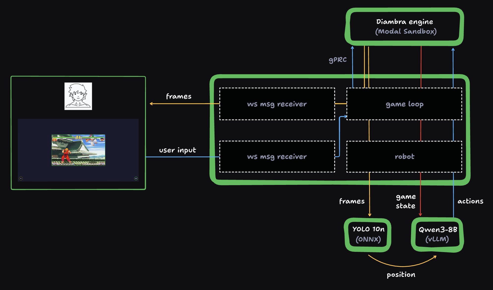
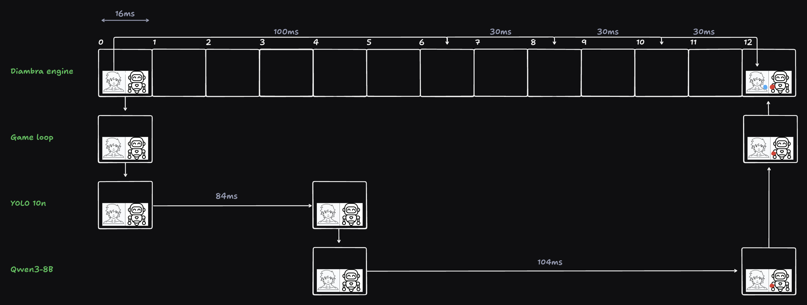
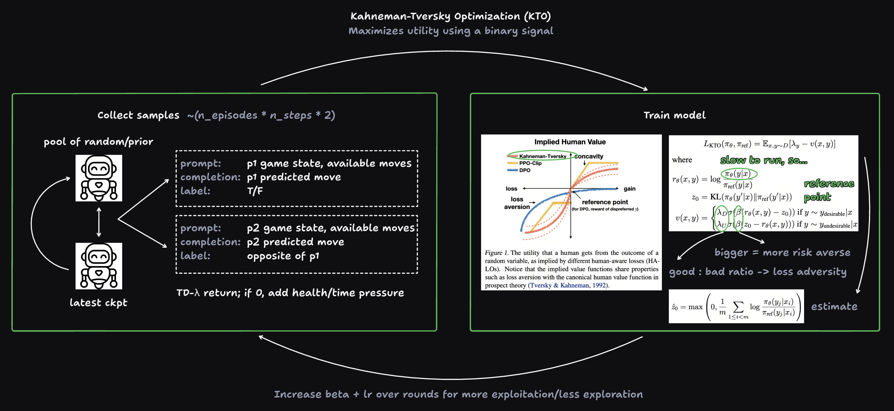

# sf3

An interactive Street Fighter 3 demo against an RL-trained LLM in a sandboxed game engine.

## Quickstart

### Setup

```bash
# Clone repository
git clone https://github.com/modal-labs/sf3.git
cd sf3

# Install dependencies
uv sync

# Set up Modal
modal setup
```

Sign up for a [Diambra account](https://www.diambra.ai/),
then store the token in a file named `assets/engine/credentials`.

Download the [ROM file](https://wowroms.com/en/roms/mame-0.139u1/street-fighter-iii-3rd-strike-fight-for-the-future-japan-990608-no-cd/7073.html),
then store it as `assets/engine/sfiii3n.zip`.

### Commands

```bash
# Prepare the data, train the YOLO model, and export to ONNX
modal run -m src.training.yolo --prepare --train --export

# Test the (trained) YOLO model's latency
modal run -m src.yolo

# Alternate between rounds of collecting self-play data and training the LLM
modal run -m src.training.llm

# Test the (pretrained or trained) LLM's latency
modal run -m src.llm

# Serve the web app
modal serve -m src.app

# Deploy the web app
modal deploy -m src.app
```

## For the interested

### Background

The goal of this project was to promote [Modal sandboxes](https://modal.com/docs/guide/sandbox) which are useful for code execution, computer use, and serving long-running services; more specifically, its utility for RL rollouts and LLMs. [LLM Colosseum](https://github.com/OpenGenerativeAI/llm-colosseum/tree/main), a hackathon project made at a Mistral Hackathon in 2024 to benchmark LLMs by fighting in Street Fighter 3, caught my eye since they were using [Diambra](https://docs.diambra.ai/), a collection of environments for RL, to host the gameplay. I noticed that sandboxes are useful here because the Diambra engine is stateful and ephemeral per match! Of course, I also saw the opportunity to run the LLM on Modal.

### Interactive Demo

Below is a diagram explaining how the application works:



We have four important services, each running in their own Modal container:

1. **Web server**: serves the frontend and websocket to stream user input and game frames.
2. **Diambra engine**: steps through the environment given both players' actions and returns game state and frames.
3. **YOLO**: receives game frames and returns character positions.
4. **LLM**: receives game frames and game state and returns a text description of an action that may contain 1+ buttons.

Some important notes for how this even works:

- By colocating the web server and Diambra engine in the [same region closest to Modal's control plane](https://modal.com/docs/guide/geographic-latency#geographic-latency), `us-east-1`, and because they communicate over gRPC via an [unencrypted port](https://modal.com/docs/guide/tunnels#advanced-unencrypted-tcp-tunnels), we can send frames over the websocket at nearly the game's native 164 FPS, as shown in the [RL self-play data collection and gameplay against GPT-5](#llm-evaluation). In fact, to enable real-time play, we have to manually slow it down to 60 FPS!
- The game loop and robot run in their own asyncio loops so consistent FPS is maintained. To send state between the two loops, we simply store frames/actions in nonlocal variables w.r.t. the loops, so each loop operates on the latest frame/action. The robot contains [`remote.aio`](https://modal.com/docs/guide/async) calls to both the YOLO and LLM so as to not block the [event loop](https://docs.python.org/3/library/asyncio-eventloop.html).
- Since the LLM is text-only, and position information isn't exposed by Diambra for RL training purposes, we must use a YOLO model fine-tuned on [synthetic scenes of actual character sprites](#yolo-training) to get around these limitations.
- By enabling [chunked prefill](https://docs.vllm.ai/en/latest/configuration/optimization.html#chunked-prefill_1) for the LLM, we maximize output token throughput, essential for real-time LLM responsiveness. Since the LLM operates on each frame, we achieve move variety by eliminating eight of the most recent moves from the available move choices (8 was empirically the smallest number that made the gameplay look good).

Below is a diagram explaining the latency for one action:



Note that at 60 FPS, each frame is emitted once every 16ms. Also, since the latency the web server communicates with the Diambra engine and the latency of storing nonlocal variables is much lower than everything else, we treat it as basically instantaneous.

Some napkin math:

- On average, each action contains 4 button presses.
- For a human, a fast reaction time to button press is about 100ms, and each subsequent button press repeat is about 30ms, so with perfect play we get 100 + 3 x 30 = 190ms/action or 5 actions/s.
- For the robot, the YOLO model takes about 84ms/frame while the LLM takes about 104ms/frame, so with perfect play we get 84 + 104 = 188ms/action, so it roughly matches human play!

### YOLO Training

Below are some results from training the YOLO model:


Note that we care most about recall here since we want to make sure all characters are detected.

### LLM Training

Below is a diagram explaining how we train the LLM using RL:



We use a self-play temporal-difference policy-gradient approach (here, the policy is an LLM instead of something like an actor-critic) that is "bootstrapped" by prior knowledge from the LLM, meaning we don't require expert data but instead rely only on given features such as game state. This is inspired by [TD Gammon for the game of Backgammon](https://davidstarsilver.wordpress.com/wp-content/uploads/2025/04/lecture-10-case-study-rl-in-classic-games.pdf), though search was not implemented for sake of time.

Beyond the [results we achieve](#llm-evaluation), this approach also matches standard RL algorithm sample efficiency: for [normal PPO](https://www.youtube.com/watch?v=zs-3qltqa7o), getting any improvement takes roughly 10M steps. For our small run, we utilize 10 rounds x 45 episodes/round x ~32k samples/episode x 1 step/sample = 14.5M steps.

Looking at the [training curves](https://wandb.ai/andrewhinh/sf3-llm-train-qwen3-8b-10-1000/workspace?nw=nwuserandrewhinh), we care most that the eval reward margins are positive and slightly increasing for each round. Intuitively, the LLM faces a pool of increasingly more difficult opponents each round, so we want the LLM to learn at least something about how to beat itself from before, even if it's not substantial.

Some important notes for getting this to work:

- To reduce the difficulty of the task at hand, we only use the character Ryu with the same outfit and super art so that the LLM doesn't have to learn how to play as all characters and how to use all super arts. We also use the smallest recommended global batch size (32) and learning rates (5e-7 to 1e-6) to limit the amount of noise during training.
- The discounted lambda returns are set for every 32 moves, since that is roughly the length of a round (best of 3).
- We use Qwen3-8B as opposed to Qwen3-8B-Base since the bootstrapping and training results seem to depend on a better-aligned model.
- Since the LLM is relatively small, we use higher beta values to expedite training as recommended by [the paper](https://arxiv.org/pdf/2402.01306).

### LLM Evaluation

To measure the efficacy of training, we compare the LLM's performance against GPT-5 over 20 matches before and after training.

#### Baseline

- Qwen3-8B's win rate is 30% with an ELO of 1167.22.
- GPT-5's win rate is 60% with an ELO of 1232.78.

Below are some visualizations:


https://github.com/user-attachments/assets/9064c7e1-cd07-4592-99f9-243d190654d8

#### After training

- Qwen3-8B's win rate is 55% with an ELO of 1227.31.
- GPT-5's win rate is 25% with an ELO of 1172.69.

Below are some visualizations:


https://github.com/user-attachments/assets/0d290da3-7e89-4db9-8bac-145e7048c109

## Credit

### Icons

- [Help](https://www.flaticon.com/free-icons/question)
- [Close](https://www.flaticon.com/free-icons/close)
- [Keyboard](https://www.flaticon.com/free-icons/electric-keyboard)
- [Gamepad](https://www.flaticon.com/free-icons/controller)
- [Human](https://www.flaticon.com/free-icons/muscle)
- [LLM](https://www.flaticon.com/free-icons/robot)
- [Mute/unmute icons](https://feathericons.com/)

### LLM

- [Qwen3 chat template](https://qwen.readthedocs.io/en/latest/_downloads/c101120b5bebcc2f12ec504fc93a965e/qwen3_nonthinking.jinja)

### Logos

- [Capcom](https://logos.fandom.com/wiki/Capcom?file=Capcom.svg)
- [Favicon](https://images.app.goo.gl/Dx3mLrW8dorr92Uq7)
- [Modal](https://live.standards.site/modal)

### Characters

- [Outfits](https://www.zytor.com/~johannax/jigsaw/sf/3s.html)
- [Moves/portraits](https://streetfighter.fandom.com/wiki/List_of_moves_in_Street_Fighter_III:_3rd_Strike)

### Sounds

- [Gamepad connect](https://orangefreesounds.com/usb-connection-sound-effect/)
- [Gamepad disconnect](https://www.myinstants.com/en/instant/windows-10-usb-disconnect-8906/)
- [Button click](https://freesound.org/people/orginaljun/sounds/157871/)
- [Button/link hover](https://freesound.org/people/steaq/sounds/757328/)
- [Coin insert](https://www.myinstants.com/en/instant/street-fighter-ii-coin/)
- [Original SF3](https://downloads.khinsider.com/game-soundtracks/album/street-fighter-iii-third-strike)
