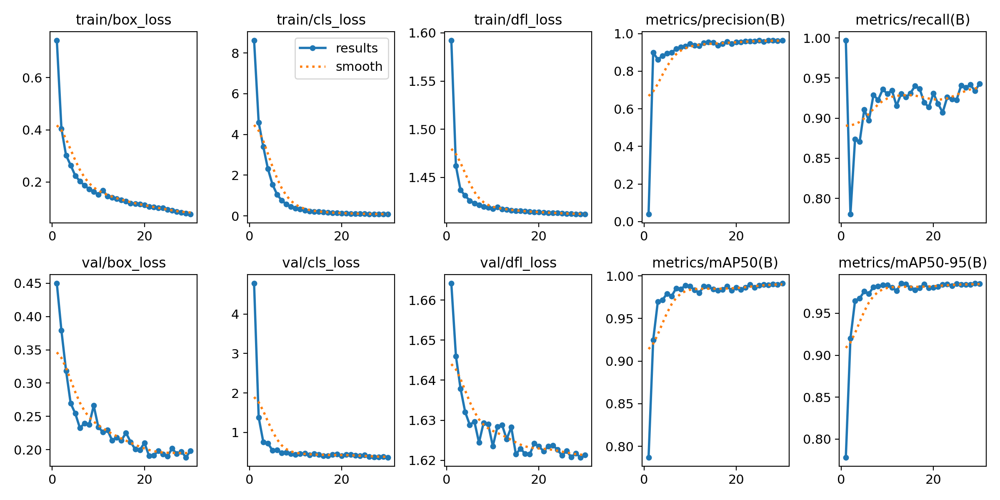
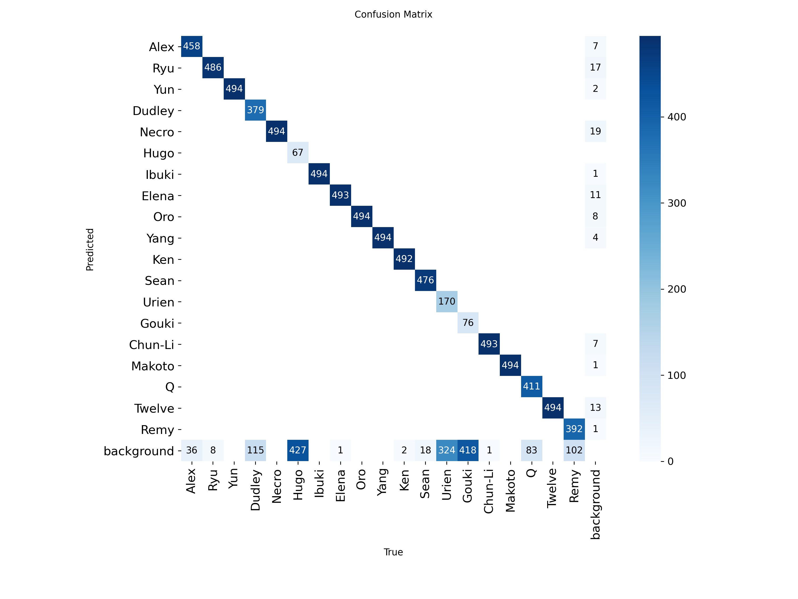
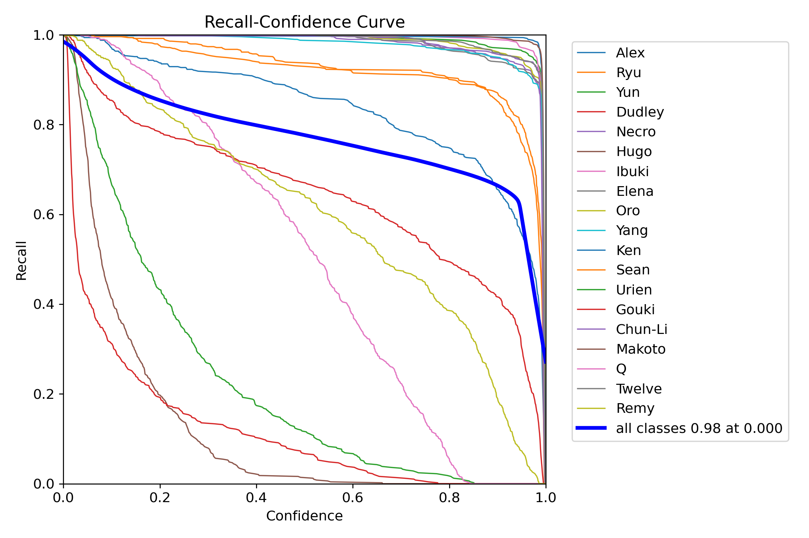
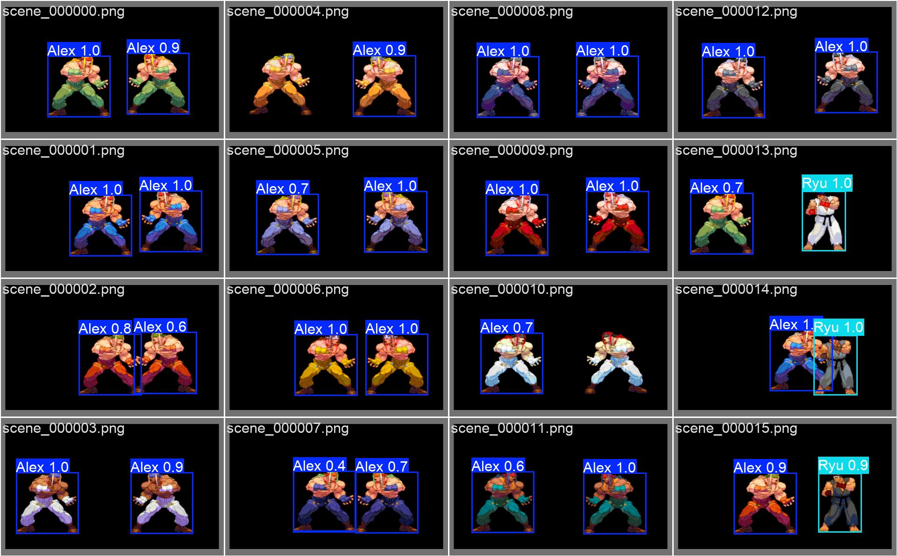
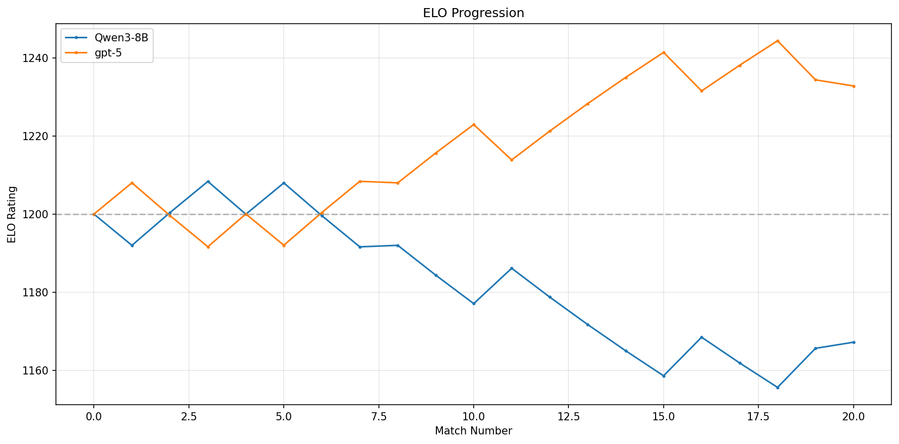
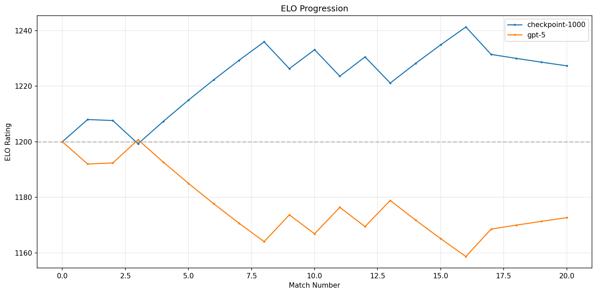

# sf3

An interactive Street Fighter 3 demo against an RL-trained LLM in a sandboxed game engine.

## Installation

```bash
# Clone repository
git clone https://github.com/modal-labs/sf3.git
cd sf3

# Install dependencies
uv sync

# Set up Modal
modal setup
```

### Diambra

Sign up for a [Diambra account](https://www.diambra.ai/),
then store the token in a file named `assets/engine/credentials`.

Download the [ROM file](https://wowroms.com/en/roms/mame-0.139u1/street-fighter-iii-3rd-strike-fight-for-the-future-japan-990608-no-cd/7073.html),
then store it as `assets/engine/sfiii3n.zip`.

## Quickstart

```bash
# Test the (trained) YOLO model
modal run -m src.yolo

# Test the (pretrained or trained) LLM
modal run -m src.llm

# Serve the web app
modal serve -m src.app

# Deploy the web app
modal deploy -m src.app
```

## Training

### YOLO

```bash
# Prepare the data, train the YOLO model, and export to ONNX
modal run -m src.training.yolo --prepare --train --export
```






### LLM

```bash
# Alternate between rounds of collecting data and training the LLM
modal run -m src.training.llm
```

#### Baseline results

- Qwen3-8B win rate=30%, ELO=1167.22
- GPT-5 win rate=60%, ELO=1232.78


<video src="./assets/readme/eval_3_baseline.mp4" controls style="width: 100%;">
Your browser does not support the video tag.
</video>

#### Trained results

- [Training curves](https://wandb.ai/andrewhinh/sf3-llm-train-qwen3-8b-10-1000/workspace?nw=nwuserandrewhinh)
- Qwen3-8B win rate=55%, ELO=1227.31
- GPT-5 win rate=25%, ELO=1172.69


<video src="./assets/readme/eval_3_9-20250821_000252.mp4" controls style="width: 100%;">
Your browser does not support the video tag.
</video>

## Credit

### Icons

- [Help](https://www.flaticon.com/free-icons/question)
- [Close](https://www.flaticon.com/free-icons/close)
- [Keyboard](https://www.flaticon.com/free-icons/electric-keyboard)
- [Gamepad](https://www.flaticon.com/free-icons/controller)
- [Human](https://www.flaticon.com/free-icons/muscle)
- [LLM](https://www.flaticon.com/free-icons/robot)
- [Mute/unmute icons](https://feathericons.com/)

### LLM

- [Qwen3 chat template](https://qwen.readthedocs.io/en/latest/_downloads/c101120b5bebcc2f12ec504fc93a965e/qwen3_nonthinking.jinja)

### Logos

- [Capcom](https://logos.fandom.com/wiki/Capcom?file=Capcom.svg)
- [Favicon](https://images.app.goo.gl/Dx3mLrW8dorr92Uq7)
- [Modal](https://live.standards.site/modal)

### Characters

- [Outfits](https://www.zytor.com/~johannax/jigsaw/sf/3s.html)
- [Moves/portraits](https://streetfighter.fandom.com/wiki/List_of_moves_in_Street_Fighter_III:_3rd_Strike)

### Sounds

- [Gamepad connect](https://orangefreesounds.com/usb-connection-sound-effect/)
- [Gamepad disconnect](https://www.myinstants.com/en/instant/windows-10-usb-disconnect-8906/)
- [Button click](https://freesound.org/people/orginaljun/sounds/157871/)
- [Button/link hover](https://freesound.org/people/steaq/sounds/757328/)
- [Coin insert](https://www.myinstants.com/en/instant/street-fighter-ii-coin/)
- [Original SF3](https://downloads.khinsider.com/game-soundtracks/album/street-fighter-iii-third-strike)
